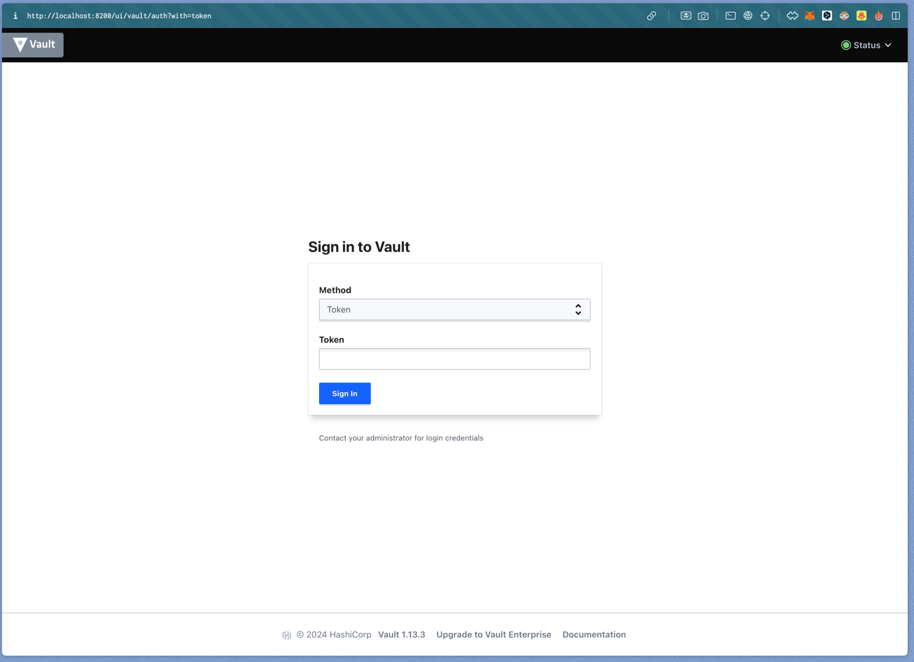
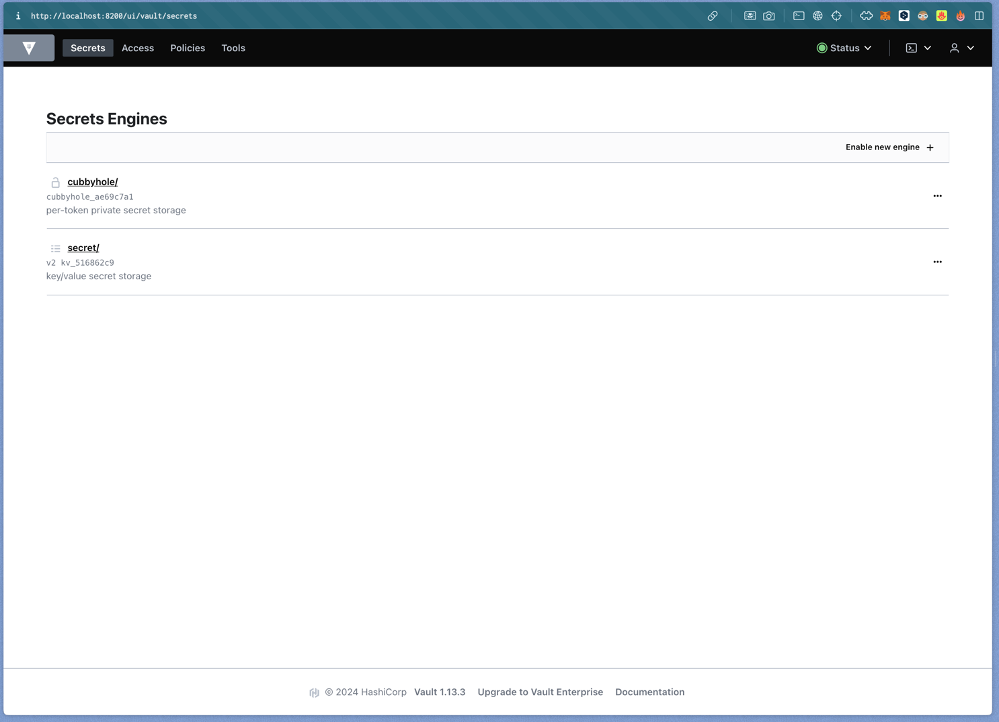

University: [ITMO University](https://itmo.ru/ru/)
Faculty: [FICT](https://fict.itmo.ru)
Course: [Introduction to distributed technologies](https://github.com/itmo-ict-faculty/introduction-to-distributed-technologies)
Year: 2023/2024
Group: K4111c
Author: Kayranov Svyatoslav Eduardovich
Lab: Lab1
Date of create: 26.02.2024
Date of finished: ~

Меняем контекст у kubectl на minikube
```bash
$ kubectl config set-context minikube
Context "minikube" modified.
```

Запускаем minikube
```bash
$ minikube start
😄  minikube v1.32.0 on Darwin 13.5.2 (arm64)
🆕  Kubernetes 1.28.3 is now available. If you would like to upgrade, specify: --kubernetes-version=v1.28.3
✨  Using the docker driver based on existing profile
👍  Starting control plane node minikube in cluster minikube
🚜  Pulling base image ...
🔄  Restarting existing docker container for "minikube" ...
❗  Image was not built for the current minikube version. To resolve this you can delete and recreate your minikube cluster using the latest images. Expected minikube version: v1.31.0 -> Actual minikube version: v1.32.0
🐳  Preparing Kubernetes v1.27.4 on Docker 24.0.4 ...
🔗  Configuring bridge CNI (Container Networking Interface) ...
🔎  Verifying Kubernetes components...
▪ Using image docker.io/kubernetesui/dashboard:v2.7.0
▪ Using image registry.k8s.io/metrics-server/metrics-server:v0.6.4
▪ Using image gcr.io/k8s-minikube/storage-provisioner:v5
▪ Using image docker.io/kubernetesui/metrics-scraper:v1.0.8
💡  Some dashboard features require the metrics-server addon. To enable all features please run:

    minikube addons enable metrics-server   


🌟  Enabled addons: default-storageclass, storage-provisioner, metrics-server, dashboard
🏄  Done! kubectl is now configured to use "minikube" cluster and "default" namespace by default
```

Создаем под vault
```bash
$ kubectl apply -f vault.yaml   
pod/vault created
```

Проверяем, что под поднялся
```bash
$ kubectl get pods
NAME    READY   STATUS    RESTARTS   AGE
vault   1/1     Running   0          2m2s
```

Для доступа к vault извне создаем сервис
```bash
$ minikube kubectl --expose pod vault --type=NodePort --port=8200
service/vault exposed
```

Делаем проброс порта
```bash
$ minikube kubectl --port-forward service/vault 8200:8200
Forwarding from 127.0.0.1:8200 -> 8200
Forwarding from [::1]:8200 -> 8200
Handling connection for 8200
Handling connection for 8200
Handling connection for 8200
Handling connection for 8200
Handling connection for 8200
Handling connection for 8200
```

Проверяем, что vault доступен


Находим токен для доступа в логах пода
```bash
$ kubectl logs pods/vault
```
