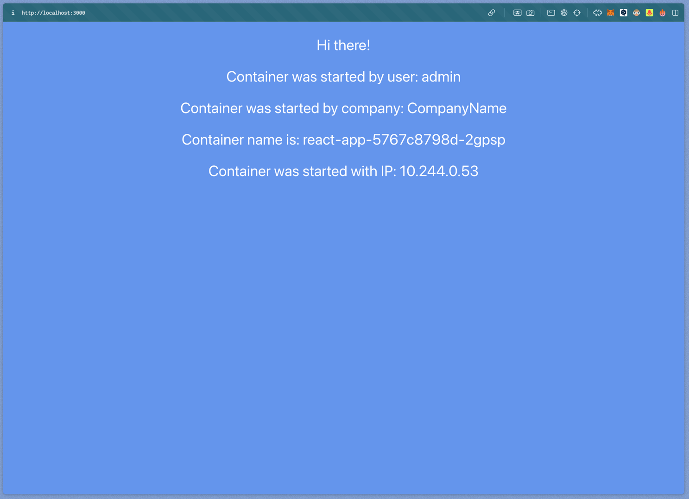

University: [ITMO University](https://itmo.ru/ru/)
Faculty: [FICT](https://fict.itmo.ru)
Course: [Introduction to distributed technologies](https://github.com/itmo-ict-faculty/introduction-to-distributed-technologies)
Year: 2023/2024
Group: K4111c
Author: Kayranov Svyatoslav Eduardovich
Lab: Lab1
Date of create: 26.02.2024
Date of finished: ~

Создаем деплоймент с двумя репликацми контейнера `ifilyaninitmo/itdt-contained-frontend:master`: [react.yaml](react.yaml)
```bash
$ kubectl apply -f react.yaml
deployment.apps/react-app created
```

Создаем сервис для доступа к деплойменту извне: [react-service.yaml](react-service.yaml)
```bash
$ kubectl apply -f react-service.yaml
service/react-app created
```

Пробрасываем порт до сервиса
```bash
$ kubectl port-forward services/react-app 3000:3000
```

