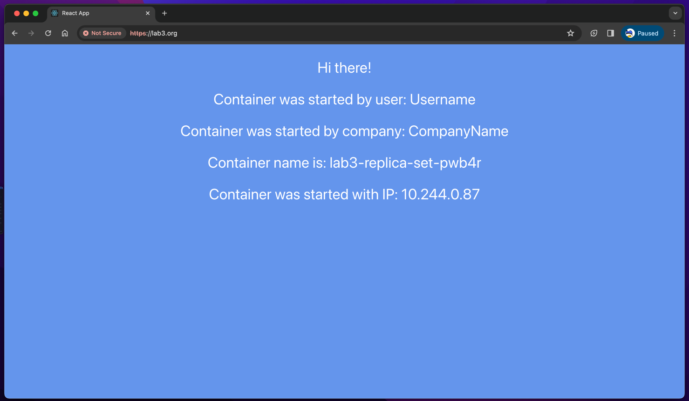
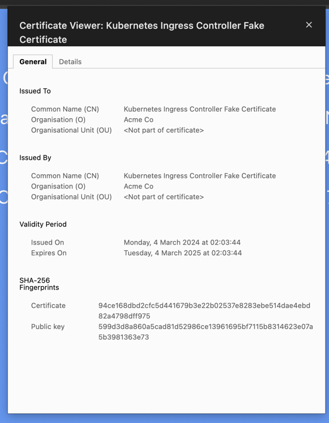
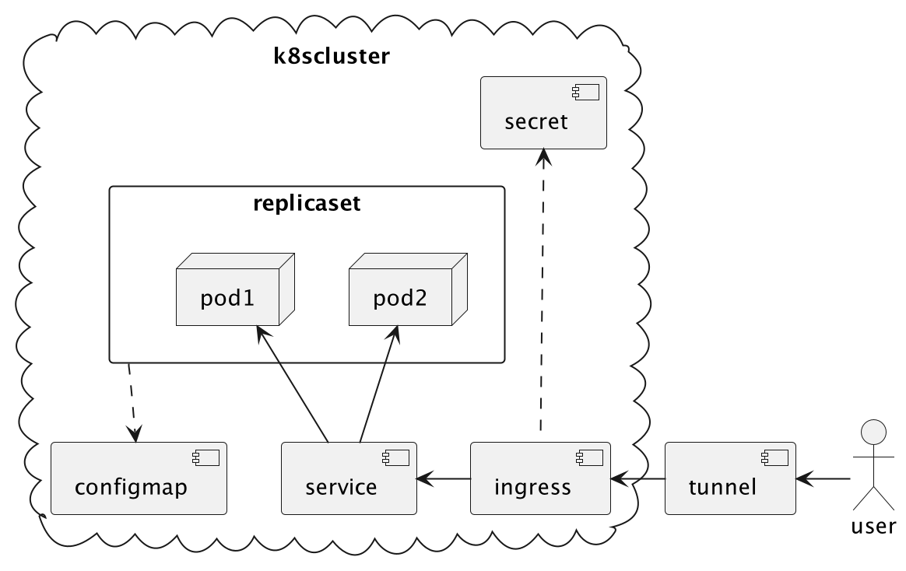

University: [ITMO University](https://itmo.ru/ru/) \
Faculty: [FICT](https://fict.itmo.ru) \
Course: [Introduction to distributed technologies](https://github.com/itmo-ict-faculty/introduction-to-distributed-technologies) \
Year: 2023/2024 \
Group: K4111c \
Author: Kayranov Svyatoslav Eduardovich \
Lab: Lab2 \
Date of create: 26.02.2024 \
Date of finished: ~

Создаем манифест для ConfigMap:
```yaml
apiVersion: v1
kind: ConfigMap
metadata:
  name: config-map-react
data:
  REACT_APP_USERNAME: "Username"
  REACT_APP_COMPANY_NAME: "CompanyName"
```

Деплоим его на кластер через команду `kubectl create -f config-map-react.yaml`.
Смотрим что ConfigMap успешно задеплоился.
```
s.kayranov@macbook-JHQ7T4G4R2 lab3 % kubectl get configmaps
NAME               DATA   AGE
config-map-react   2      29s
kube-root-ca.crt   1      143d
```

Создаем манифест для ReplicaSet:
```yaml
apiVersion: apps/v1
kind: ReplicaSet
metadata:
  name: react-replica-set
  labels:
    app: react-replica-set
spec:
  replicas: 2
  selector:
    matchLabels:
      app: react-replica-set
  template:
    metadata:
      name: react-replica-set
      labels:
        app: react-replica-set
    spec:
      containers:
        - name: react-replica-set
          env:
            - name: REACT_APP_USERNAME
              valueFrom:
                configMapKeyRef:
                  name: config-map-react
                  key: REACT_APP_USERNAME
            - name: REACT_APP_COMPANY_NAME
              valueFrom:
                configMapKeyRef:
                  name: config-map-react
                  key: REACT_APP_COMPANY_NAME
          image: ifilyaninitmo/itdt-contained-frontend:master
          imagePullPolicy: IfNotPresent
          ports:
            - containerPort: 3000
      restartPolicy: Always
```

Деплоим его на кластер через команду `kubectl create -f react-3.yaml`.
Смотрим что ConfigMap успешно задеплоился.
```
s.kayranov@macbook-JHQ7T4G4R2 lab3 % kubectl get replicasets.apps
NAME                   DESIRED   CURRENT   READY   AGE
react-app-5767c8798d   2         2         2       6d1h
react-app-685c9d4f96   0         0         0       6d1h
react-app-786b64df8d   0         0         0       6d1h
react-replica-set      2         2         2       17s
```

Создаем манифест для Service:
```yaml
apiVersion: v1
kind: Service
metadata:
  name: lab3
spec:
  selector:
    app: react-replica-set
  ports:
    - protocol: TCP
      port: 3000
      targetPort: 3000
  type: NodePort
```

Деплоим его на кластер через команду `kubectl create -f service.yaml`.
Смотрим что ConfigMap успешно задеплоился.
```
s.kayranov@macbook-JHQ7T4G4R2 lab3 % kubectl get service
NAME         TYPE        CLUSTER-IP       EXTERNAL-IP   PORT(S)          AGE
kubernetes   ClusterIP   10.96.0.1        <none>        443/TCP          143d
lab3         NodePort    10.104.137.217   <none>        3000:31224/TCP   9s
react-app    NodePort    10.104.210.134   <none>        3000:30718/TCP   6d1h
vault        NodePort    10.97.105.81     <none>        8200:30953/TCP   6d2h
```

Генерируем сертификат \
Смотрим [оффициальный мануал](https://kubernetes.io/docs/tasks/administer-cluster/certificates/) и копируем команды:
```bash
$ openssl genrsa -out ca.key 2048
$ openssl req -x509 -new -nodes -key lab3.key -days 10000 -out lab3.crt

You are about to be asked to enter information that will be incorporated
into your certificate request.
What you are about to enter is what is called a Distinguished Name or a DN.
There are quite a few fields but you can leave some blank
For some fields there will be a default value,
If you enter '.', the field will be left blank.
-----
Country Name (2 letter code) [AU]:RU
State or Province Name (full name) [Some-State]:SPB
Locality Name (eg, city) []:spb   
Organization Name (eg, company) [Internet Widgits Pty Ltd]:
Organizational Unit Name (eg, section) []:
Common Name (e.g. server FQDN or YOUR name) []:lab3.org
Email Address []:

```
Создаем секрет для хранения нашего сертификата:
```
kubectl create secret tls tls-secret --key="lab3.key" --cert="lab3.crt"
secret/my-secret created
```

Создаем манифест для ingress:
```yaml
apiVersion: networking.k8s.io/v1
kind: Ingress
metadata:
  name: lab3-ingress
  annotations:
    nginx.ingress.kubernetes.io/rewrite-target: /
spec:
  tls:
    - hosts:
        - lab3.org
      secretName: my-secret
  ingressClassName: nginx
  rules:
    - host: lab3.org
    - http:
        paths:
          - path: /
            pathType: Prefix
            backend:
              service:
                name: react-replica-set
                port:
                  number: 3000
```
`kubectl create -f ingress.yaml`

Применяем туннелирование:
`minikube tunnel`

Меняем `/etc/hosts` и добавляем следующую строку
```
127.0.0.1       lab3.org www.lab3.org
```

Заходим на https://lab3.org из браузера.

Получаем 404 ошибку от nginx.
Тратим 3 часа на разбирательства.

Меняем манифест для ingress c
```yaml
rules:
    - host: lab3.org
    - http:
```
на 
```yaml
rules:
    - host: lab3.org
      http:
```

Накатываем новый ингресс и смотрим:


Сертификат:


Схема:
