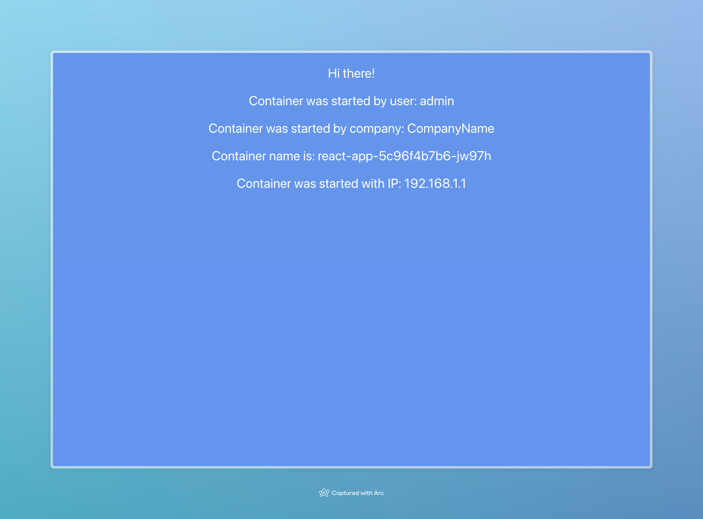
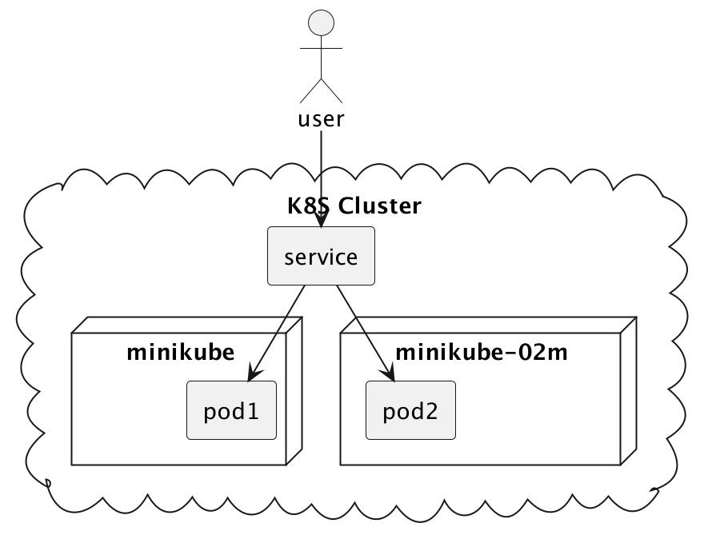

University: [ITMO University](https://itmo.ru/ru/) \
Faculty: [FICT](https://fict.itmo.ru) \
Course: [Introduction to distributed technologies](https://github.com/itmo-ict-faculty/introduction-to-distributed-technologies) \
Year: 2023/2024 \
Group: K4111c \
Author: Kayranov Svyatoslav Eduardovich \
Lab: Lab2 \
Date of create: 26.02.2024 \
Date of finished: ~

Следуая [инструкции](https://docs.tigera.io/calico/latest/getting-started/kubernetes/minikube), 
подключаем calico и добавляем еще одну ноду в minikube кластер:

```bash
$ minikube start --network-plugin=cni --cni=calico

😄  minikube v1.32.0 on Darwin 13.5.2 (arm64)
✨  Automatically selected the docker driver. Other choices: parallels, qemu2, ssh
❗  With --network-plugin=cni, you will need to provide your own CNI. See --cni flag as a user-friendly alternative
📌  Using Docker Desktop driver with root privileges
👍  Starting control plane node minikube in cluster minikube
🚜  Pulling base image ...
💾  Downloading Kubernetes v1.28.3 preload ...
    > preloaded-images-k8s-v18-v1...:  341.16 MiB / 341.16 MiB  100.00% 48.69 M
    > index.docker.io/kicbase/sta...:  410.58 MiB / 410.58 MiB  100.00% 33.69 M
❗  minikube was unable to download gcr.io/k8s-minikube/kicbase:v0.0.42, but successfully downloaded docker.io/kicbase/stable:v0.0.42 as a fallback image
🔥  Creating docker container (CPUs=2, Memory=7902MB) ...
🐳  Preparing Kubernetes v1.28.3 on Docker 24.0.7 ...
    ▪ Generating certificates and keys ...
    ▪ Booting up control plane ...
    ▪ Configuring RBAC rules ...
🔗  Configuring Calico (Container Networking Interface) ...
🔎  Verifying Kubernetes components...
    ▪ Using image gcr.io/k8s-minikube/storage-provisioner:v5
🌟  Enabled addons: storage-provisioner, default-storageclass
🏄  Done! kubectl is now configured to use "minikube" cluster and "default" namespace by default

$ kubectl get pods -l k8s-app=calico-node -A 

NAMESPACE     NAME                READY   STATUS    RESTARTS   AGE
kube-system   calico-node-wfrtt   1/1     Running   0          2m9s

$ minikube node add


😄  Adding node m02 to cluster minikube
❗  Cluster was created without any CNI, adding a node to it might cause broken networking.
👍  Starting worker node minikube-m02 in cluster minikube
🚜  Pulling base image ...
🔥  Creating docker container (CPUs=2, Memory=2200MB) ...
🐳  Preparing Kubernetes v1.28.3 on Docker 24.0.7 ...
🔎  Verifying Kubernetes components...
🏄  Successfully added m02 to minikube!
$ kubectl get nodes

NAME           STATUS   ROLES           AGE     VERSION
minikube       Ready    control-plane   6m5s    v1.28.3
minikube-m02   Ready    <none>          2m58s   v1.28.3
```

Настаиваем calico:
Маркируем наши ноды лейблами.
Удаляем дефолтный и добавляем два новых айпи пула с селектором по лейбалам нод.
Проверяем, что айпишники успешно заассайнились на наши поды.
```bash
$ kubectl calico get ippool -o wide --allow-version-mismatch
NAME                  CIDR            NAT    IPIPMODE   VXLANMODE   DISABLED   DISABLEBGPEXPORT   SELECTOR   
default-ipv4-ippool   10.244.0.0/16   true   Always     Never       false      false              all() 

$ calicoctl delete ippools default-ipv4-ippool --allow-version-mismatch
Successfully deleted 1 'IPPool' resource(s)

$ kubectl get nodes
NAME           STATUS   ROLES           AGE   VERSION
minikube       Ready    control-plane   40m   v1.28.3
minikube-m02   Ready    <none>          37m   v1.28.3

$ kubectl label nodes minikube zone=west
node/minikube labeled
$ kubectl label nodes minikube-m02 zone=east 
node/minikube-m02 labeled

$ calicoctl create -f calico-ippool-west.yaml --allow-version-mismatch
Successfully created 1 'IPPool' resource(s)
$ calicoctl create -f calico-ippool-east.yaml --allow-version-mismatch
Successfully created 1 'IPPool' resource(s)

$ calicoctl get ippool -o wide --allow-version-mismatch
NAME          CIDR             NAT    IPIPMODE   VXLANMODE   DISABLED   DISABLEBGPEXPORT   SELECTOR         
east-ippool   192.168.1.0/24   true   Always     Never       false      false              zone == "east"   
west-ippool   192.168.0.0/24   true   Always     Never       false      false              zone == "west"

$ kubectl get pods -owide               
NAME                         READY   STATUS    RESTARTS   AGE   IP             NODE           NOMINATED NODE   READINESS GATES
react-app-5c96f4b7b6-jw97h   1/1     Running   0          42s   192.168.1.1    minikube-m02   <none>           <none>
react-app-5c96f4b7b6-t9brh   1/1     Running   0          42s   192.168.0.65   minikube       <none>           <none>

```

Смотрим что все работает.

```bash
$ kubectl create -f service.yaml 
service/react-app created

$ kubectl port-forward services/react-app 3000:3000
Forwarding from 127.0.0.1:3000 -> 3000
Forwarding from [::1]:3000 -> 3000
Handling connection for 3000
Handling connection for 3000
Handling connection for 3000
```



Пингуем соседний под
```bash
s.kayranov@macbook-JHQ7T4G4R2 lab4 % kubectl exec pods/react-app-5c96f4b7b6-t9brh ping 192.168.1.1
kubectl exec [POD] [COMMAND] is DEPRECATED and will be removed in a future version. Use kubectl exec [POD] -- [COMMAND] instead.
PING 192.168.1.1 (192.168.1.1): 56 data bytes
64 bytes from 192.168.1.1: seq=0 ttl=62 time=0.477 ms
64 bytes from 192.168.1.1: seq=1 ttl=62 time=0.674 ms
64 bytes from 192.168.1.1: seq=2 ttl=62 time=0.370 ms
64 bytes from 192.168.1.1: seq=3 ttl=62 time=6.488 ms
64 bytes from 192.168.1.1: seq=4 ttl=62 time=0.529 ms
64 bytes from 192.168.1.1: seq=5 ttl=62 time=0.337 ms
64 bytes from 192.168.1.1: seq=6 ttl=62 time=0.173 ms
64 bytes from 192.168.1.1: seq=7 ttl=62 time=0.379 ms
64 bytes from 192.168.1.1: seq=8 ttl=62 time=0.898 ms
```

Диаграмма взаимодействия:
